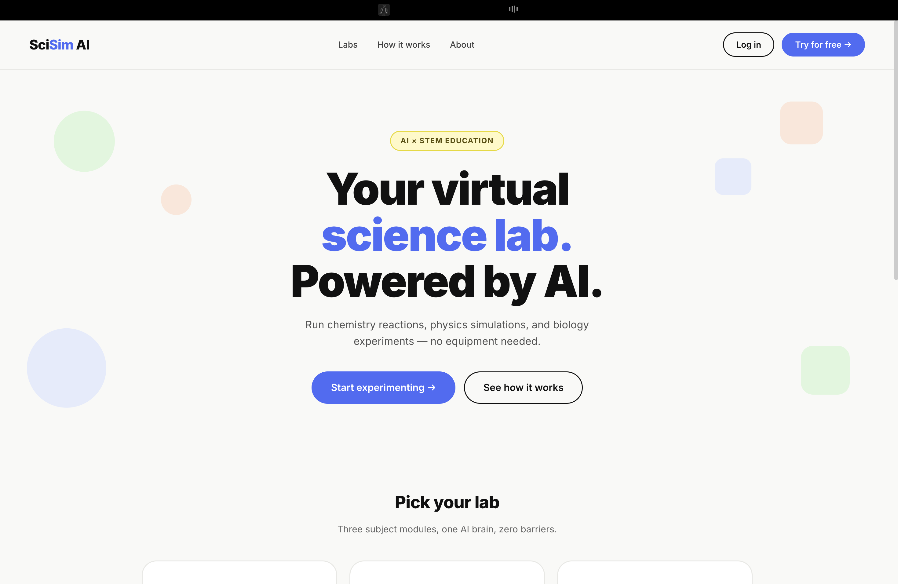
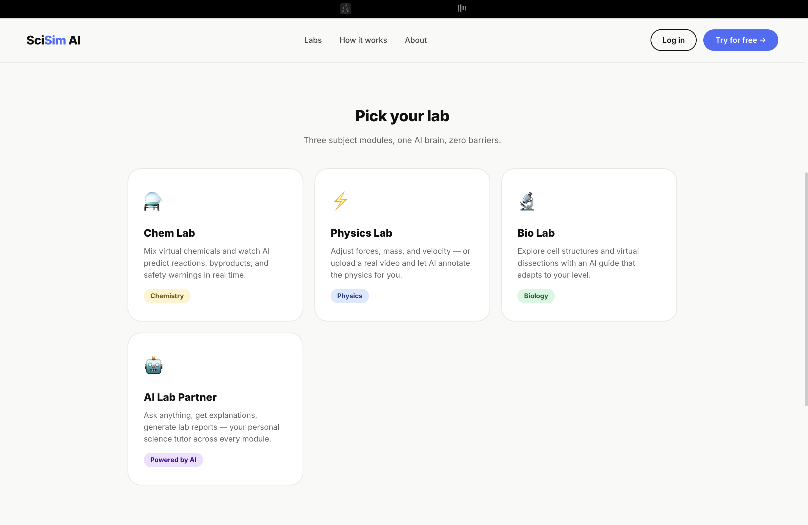
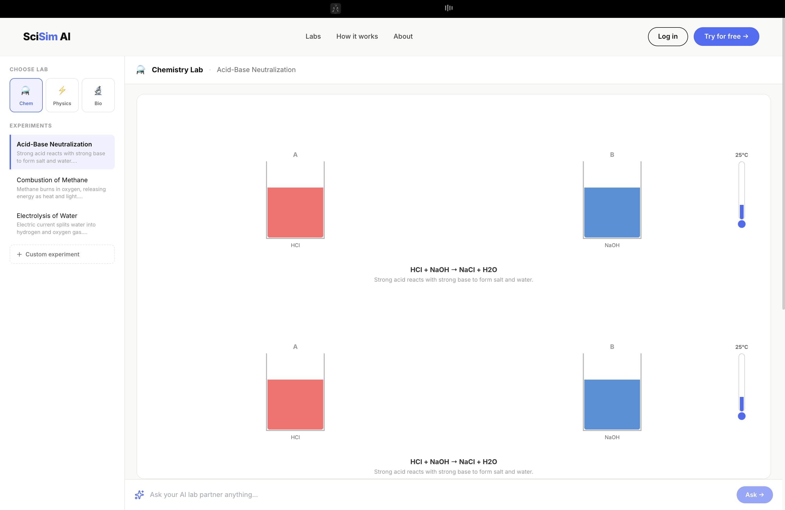
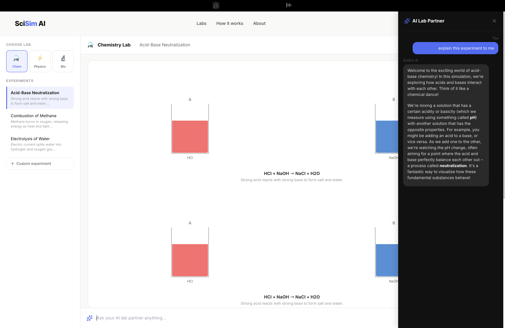
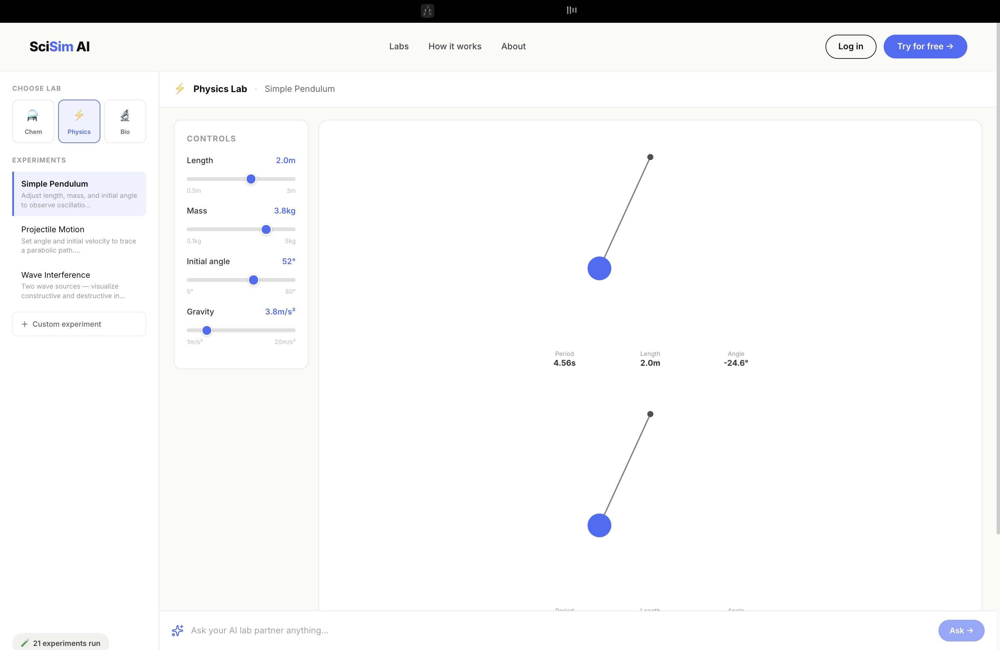
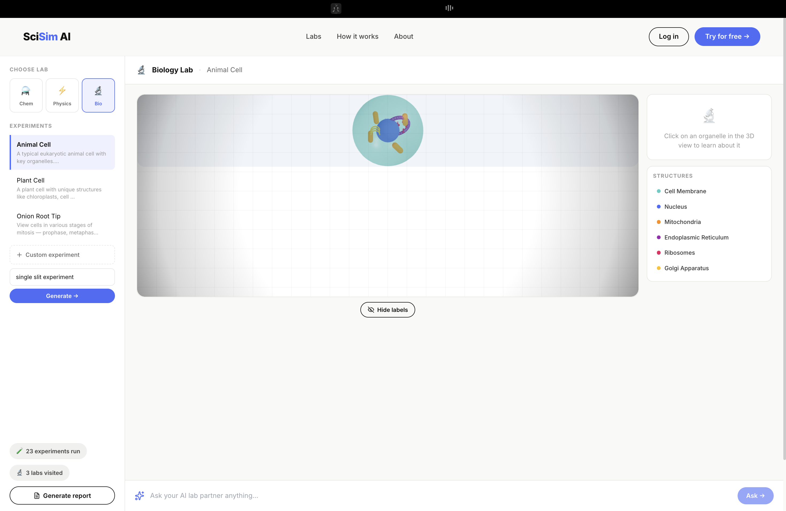
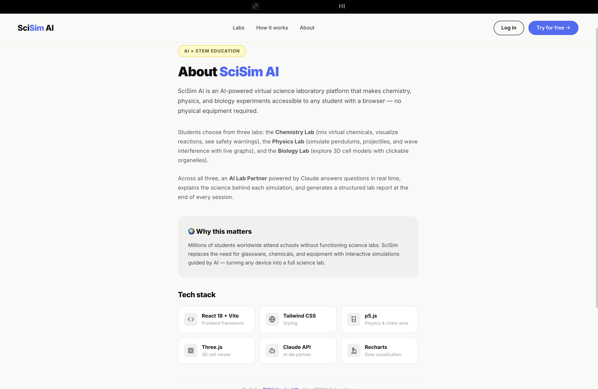
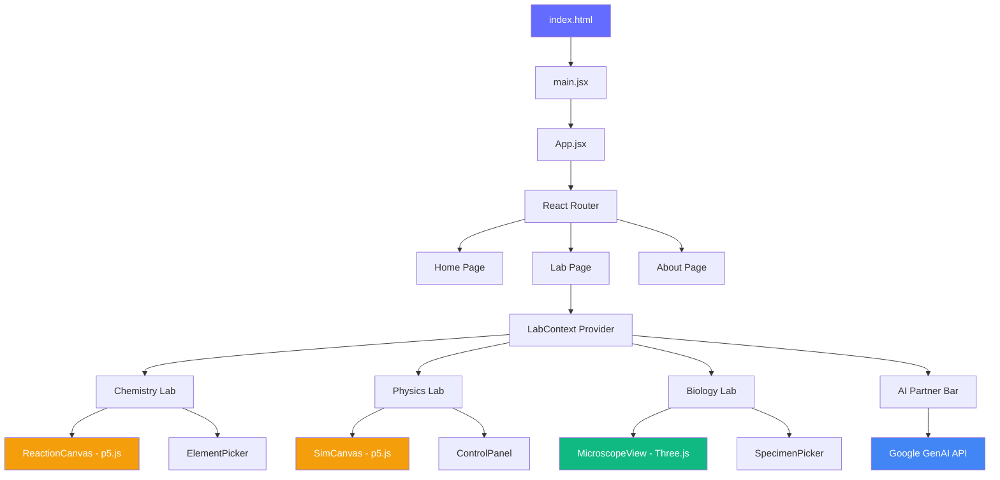

<div align="center">

# 🔬 SciSim AI

### Your Virtual Science Lab — Powered by AI

[](https://react.dev/)
[](https://vitejs.dev/)
[](https://threejs.org/)
[](https://tailwindcss.com/)
[](https://ai.google.dev/)
[](LICENSE)

**SciSim AI** is an interactive, web-based scientific simulation platform that brings laboratory experiments to life. It features immersive 3D and 2D simulations across Biology, Chemistry, and Physics — all guided by a real-time AI partner that adapts to every student's level.

*Run chemistry reactions, physics simulations, and biology experiments — no equipment needed.*

---



</div>

---

## 📑 Table of Contents

- [✨ Features](#-features)
- [📸 Screenshots](#-screenshots)
- [🛠️ Tech Stack](#️-tech-stack)
- [🏗️ Architecture](#️-architecture)
- [🚀 Getting Started](#-getting-started)
- [📁 Project Structure](#-project-structure)
- [🧪 Lab Modules](#-lab-modules)
- [🤖 AI Lab Partner](#-ai-lab-partner)
- [📜 Scripts](#-scripts)
- [🤝 Contributing](#-contributing)
- [📝 License](#-license)

---

## ✨ Features

### 🧪 Interactive Laboratory Modules

| Lab | Description | Simulations |
|-----|-------------|-------------|
| **🧫 Chemistry Lab** | Mix virtual chemicals on an interactive canvas with real-time reaction visualization | Acid-Base Neutralization, Combustion of Methane, Electrolysis of Water, Custom Experiments |
| **⚡ Physics Lab** | Run physics simulations with fully adjustable parameters and live control panels | Simple Pendulum, Projectile Motion, Wave Interference, Custom Experiments |
| **🔬 Biology Lab** | Explore 3D cell models with clickable organelles and labeled structures | Animal Cell, Plant Cell, Onion Root Tip (Mitosis), Custom Experiments |

### 🤖 AI-Powered Learning Partner
- **Real-time Q&A** — Ask anything during an experiment and get instant, context-aware explanations
- **Adaptive Guidance** — The AI partner adjusts its language and depth to match the student's level
- **Lab Report Generation** — Automatically generates structured lab reports summarizing experiments conducted

### 📈 Live Data & Visualization
- Real-time charting of experimental data with **Recharts**
- Parameter readouts that update as simulations run (period, angle, velocity, temperature, etc.)
- Progress tracking badges showing experiments run and labs visited

### 🎨 Premium UI & Animations
- Fluid page transitions and micro-interactions powered by **Framer Motion**
- Clean, modern design with responsive layouts via **Tailwind CSS**
- High-performance 3D rendering using **Three.js** and **React Three Fiber**
- 2D physics & chemistry simulations rendered with **p5.js**

---

## 📸 Screenshots

<div align="center">

### 🏠 Homepage — Hero Section
*Landing page with animated gradient blobs and call-to-action buttons*


---

### 🧭 Lab Selection — Pick Your Lab
*Choose from Chemistry, Physics, Biology labs, or explore the AI Lab Partner*



---

### 🧪 Chemistry Lab — Acid-Base Neutralization
*Interactive beakers with HCl and NaOH, temperature controls, and real-time reaction equations*



---

### 🤖 Chemistry Lab — AI Partner in Action
*AI Lab Partner explaining the acid-base neutralization experiment in a conversational sidebar*



---

### ⚡ Physics Lab — Simple Pendulum
*Pendulum simulation with adjustable length, mass, initial angle, and gravity parameters*



---

### 🔬 Biology Lab — 3D Animal Cell
*Interactive 3D cell viewer with clickable organelles and a labeled structures panel*



---

### 📖 About Page
*Project overview, mission statement, and tech stack breakdown*



</div>

---

## 🛠️ Tech Stack

| Category | Technology | Purpose |
|----------|------------|---------|
| **Framework** | [React 19](https://react.dev/) + [Vite 8](https://vitejs.dev/) | Core frontend framework & blazing-fast dev server |
| **Routing** | [React Router v7](https://reactrouter.com/) | Client-side page navigation |
| **Styling** | [Tailwind CSS 3.4](https://tailwindcss.com/) | Utility-first CSS framework |
| **Animations** | [Framer Motion 12](https://www.framer.com/motion/) | Declarative animations & page transitions |
| **3D Rendering** | [Three.js](https://threejs.org/) via [React Three Fiber](https://docs.pmnd.rs/react-three-fiber/) & [Drei](https://github.com/pmndrs/drei) | 3D cell models & organelle interaction |
| **2D Rendering** | [p5.js](https://p5js.org/) | Physics & chemistry canvas simulations |
| **Charting** | [Recharts](https://recharts.org/) | Live data visualization |
| **Icons** | [Lucide React](https://lucide.dev/) | Modern, consistent iconography |
| **AI Integration** | [Google GenAI (Gemini)](https://ai.google.dev/) | AI Lab Partner — real-time scientific assistance |

---

## 🏗️ Architecture



**Key architectural decisions:**
- **Context-driven state** — `LabContext` manages the active lab, experiment selection, and progress tracking across all modules
- **Modular lab design** — Each lab (Bio/Chem/Physics) is a self-contained module with its own experiments, renderers, and configuration
- **AI integration layer** — The `claudeApi.js` service abstracts all GenAI communication, providing a clean interface for the AI Partner component
- **Canvas rendering strategy** — p5.js for 2D physics/chemistry simulations; Three.js (via React Three Fiber) for 3D biology visualizations

---

## 🚀 Getting Started

### Prerequisites

- **Node.js** ≥ 18.x
- **npm** ≥ 9.x (or yarn / pnpm)
- A **Google Gemini API key** (for the AI Lab Partner feature)

### Installation

1. **Clone the repository:**
   ```bash
   git clone https://github.com/MohdAltamish/SciSim.git
   cd SciSim
   ```

2. **Install dependencies:**
   ```bash
   npm install
   ```

3. **Configure environment variables:**
   ```bash
   cp .env.example .env
   ```
   Open the `.env` file and add your Gemini API key:
   ```env
   VITE_GEMINI_API_KEY=your_gemini_api_key_here
   ```
   > 💡 You can obtain a free API key from [Google AI Studio](https://aistudio.google.com/apikey).

4. **Start the development server:**
   ```bash
   npm run dev
   ```

5. **Open your browser** and navigate to:
   ```
   http://localhost:5173
   ```

---

## 📁 Project Structure

```
SciSim/
├── Assets/                     # Project screenshots & documentation assets
│   ├── homepage_hero.png       # Homepage hero section screenshot
│   ├── lab_selection.png       # Lab selection cards screenshot
│   ├── chemlab_simulation.png  # Chemistry lab simulation screenshot
│   ├── chemlab_ai_partner.png  # AI partner sidebar screenshot
│   ├── physicslab_pendulum.png # Physics lab pendulum screenshot
│   ├── biolab_3d_cell.png      # Biology lab 3D cell screenshot
│   └── about_page.png          # About page screenshot
│
├── public/                     # Static public assets
├── src/
│   ├── assets/                 # App-level static assets (hero image, icons)
│   │   ├── hero.png
│   │   └── vite.svg
│   │
│   ├── components/             # Shared, reusable UI components
│   │   ├── AIPartnerBar.jsx    # AI chat sidebar with GenAI integration
│   │   ├── Footer.jsx          # Global footer
│   │   ├── LabCard.jsx         # Lab selection card component
│   │   ├── LabReportModal.jsx  # Generated lab report overlay
│   │   ├── Navbar.jsx          # Top navigation bar
│   │   ├── ProgressBadge.jsx   # Experiment progress indicators
│   │   └── SimWorkspace.jsx    # Simulation workspace container
│   │
│   ├── context/
│   │   └── LabContext.jsx      # React Context for global lab state management
│   │
│   ├── labs/                   # Individual lab modules
│   │   ├── BioLab/
│   │   │   ├── index.jsx       # BioLab entry — manages specimen state
│   │   │   ├── MicroscopeView.jsx  # Three.js 3D cell renderer
│   │   │   ├── SpecimenPicker.jsx  # Specimen selection UI
│   │   │   └── specimens.js    # Specimen data (organelles, colors, positions)
│   │   │
│   │   ├── ChemLab/
│   │   │   ├── index.jsx       # ChemLab entry — manages experiment state
│   │   │   ├── ReactionCanvas.jsx  # p5.js reaction visualizer
│   │   │   ├── ElementPicker.jsx   # Element/compound selector UI
│   │   │   └── experiments.js  # Pre-built experiment configurations
│   │   │
│   │   └── PhysicsLab/
│   │       ├── index.jsx       # PhysicsLab entry — manages simulation state
│   │       ├── SimCanvas.jsx   # p5.js physics simulation renderer
│   │       ├── ControlPanel.jsx    # Parameter sliders (length, mass, gravity, etc.)
│   │       └── experiments.js  # Pre-built experiment configurations
│   │
│   ├── pages/
│   │   ├── Home.jsx            # Landing page with hero, lab cards, how-it-works
│   │   ├── LabPage.jsx         # Main lab workspace with sidebar & AI bar
│   │   └── AboutPage.jsx       # Project info, mission, and tech stack
│   │
│   ├── services/
│   │   └── claudeApi.js        # Google GenAI (Gemini) API integration service
│   │
│   ├── App.jsx                 # Root component with routing setup
│   ├── main.jsx                # Application entry point
│   └── index.css               # Global styles & Tailwind directives
│
├── .env.example                # Environment variable template
├── .gitignore
├── eslint.config.js            # ESLint configuration
├── index.html                  # HTML entry point
├── package.json
├── postcss.config.js           # PostCSS configuration
├── tailwind.config.js          # Tailwind CSS configuration
└── vite.config.js              # Vite build configuration
```

---

## 🧪 Lab Modules

### 🧫 Chemistry Lab

The Chemistry Lab provides an interactive 2D canvas where students mix virtual chemicals and observe real-time reactions.

**Experiments included:**
| Experiment | Reaction | Description |
|------------|----------|-------------|
| Acid-Base Neutralization | `HCl + NaOH → NaCl + H₂O` | Strong acid reacts with strong base to form salt and water |
| Combustion of Methane | `CH₄ + 2O₂ → CO₂ + 2H₂O` | Methane burns in oxygen, releasing energy as heat and light |
| Electrolysis of Water | `2H₂O → 2H₂ + O₂` | Electric current splits water into hydrogen and oxygen gas |
| **Custom Experiment** | *User-defined* | Students can define their own reactants and explore AI-predicted outcomes |

**Key features:**
- Interactive beaker visualization with colored solutions
- Temperature controls with real-time thermometer readout
- Balanced equation display with reaction descriptions
- AI-assisted custom experiment creation

---

### ⚡ Physics Lab

The Physics Lab offers real-time 2D simulations of classical mechanics with fully adjustable parameters.

**Experiments included:**
| Experiment | Description | Parameters |
|------------|-------------|------------|
| Simple Pendulum | Observe oscillation with adjustable properties | Length, Mass, Initial Angle, Gravity |
| Projectile Motion | Trace parabolic trajectories | Angle, Initial Velocity |
| Wave Interference | Visualize constructive & destructive interference | Frequency, Amplitude, Phase |
| **Custom Experiment** | Students define their own physics scenarios | AI-generated parameters |

**Key features:**
- Real-time parameter sliders with instant simulation updates
- Live readouts (Period, Length, Angle, Velocity)
- Dual-simulation view for comparison experiments
- Progress tracking with experiment counter

---

### 🔬 Biology Lab

The Biology Lab provides a 3D interactive microscope view powered by Three.js, allowing students to explore cellular structures in full 3D.

**Experiments included:**
| Experiment | Description | Structures |
|------------|-------------|------------|
| Animal Cell | Explore a typical eukaryotic animal cell | Cell Membrane, Nucleus, Mitochondria, ER, Ribosomes, Golgi Apparatus |
| Plant Cell | Study unique plant cell structures | Cell Wall, Chloroplasts, Central Vacuole, and shared organelles |
| Onion Root Tip | View cells in various stages of mitosis | Prophase, Metaphase, Anaphase, Telophase |
| **Custom Experiment** | AI-generated custom specimens | Dynamic organelle configurations |

**Key features:**
- Full 3D cell model with orbit controls (rotate, zoom, pan)
- Clickable organelles with pop-up descriptions
- Color-coded structure legend panel
- Toggle-able labels for all organelles
- Custom experiment generation with AI

---

## 🤖 AI Lab Partner

The **AI Lab Partner** is an always-available sidebar assistant powered by **Google Gemini** that provides:

- **Contextual Explanations** — Understands which lab and experiment you're in, giving relevant explanations
- **Natural Language Q&A** — Ask questions like *"explain this experiment to me"* or *"what happens if I increase gravity?"*
- **Adaptive Depth** — Responds at the student's comprehension level, from beginner-friendly to advanced
- **Lab Report Generation** — Generates structured reports summarizing all experiments conducted in a session

The AI service is implemented in `src/services/claudeApi.js` and communicates with the Google GenAI API using the `@google/genai` SDK.

---

## 📜 Scripts

| Command | Description |
|---------|-------------|
| `npm run dev` | Start the Vite development server with hot module replacement |
| `npm run build` | Bundle the application into optimized static files for production |
| `npm run lint` | Run ESLint to check for code quality and style issues |
| `npm run preview` | Preview the production build locally before deployment |

---

## 🤝 Contributing

Contributions, issues, and feature requests are welcome! Here's how you can help:

1. **Fork** the repository
2. **Create** a feature branch: `git checkout -b feature/amazing-feature`
3. **Commit** your changes: `git commit -m 'Add amazing feature'`
4. **Push** to the branch: `git push origin feature/amazing-feature`
5. **Open** a Pull Request

Feel free to check the [issues page](https://github.com/MohdAltamish/SciSim/issues) for open tasks.

### Ideas for Contributions
- 🧬 Add new specimens to the Biology Lab (e.g., bacteria, viruses)
- ⚗️ Create additional chemistry experiments (e.g., titration curves, gas laws)
- 📊 Add data export functionality (CSV, PDF reports)
- 🌍 Internationalization (i18n) support
- 🧪 Unit tests for simulation logic

---

## 📝 License

This project is licensed under the **MIT License** — see the [LICENSE](LICENSE) file for details.

---

<div align="center">

**Built with ❤️ for STEM Education**

*Making science accessible to every student, everywhere.*

[⬆ Back to Top](#-scisim-ai)

</div>
